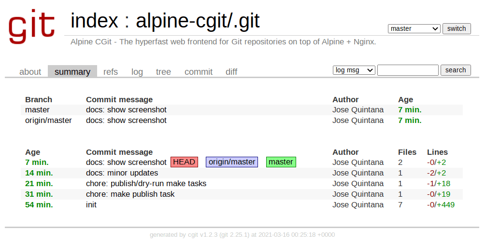

# Alpine CGit

> The hyperfast web frontend for [Git](https://git-scm.com/) repositories on top of [Alpine](https://alpinelinux.org/) + [Nginx](https://nginx.org/).

[CGit](https://git.zx2c4.com/cgit/about/) is a web interface ([cgi](https://tools.ietf.org/html/rfc3875)) for [Git](https://git-scm.com/) repositories, written in C.



## CGit features

- Basic repository browsing (logs, diffs, trees...).
- Caching of generated HTML.
- Cloneable URLs (implements dumb HTTP transport).
- Commit feeds (atom format).
- Discovery of Git repositories.
- On-the-fly archives for tags and commits.
- Plugin support for e.g. syntax highlighting.
- Side-by-side diffs.
- Simple time/author statistics.
- Simple virtual hosting support (macro expansion).
- Understands GitWeb project-lists.
- Understands gitweb.owner in Git config files.
- Has extensive filtering framework using scripts or a built-in lua interpreter.

See [CGit project](https://git.zx2c4.com/cgit/about/) for more details.

## Usage

```sh
docker compose up -d
```

## Key container paths

- `/etc/cgitrc`: Default CGit configuration file.
- `/srv/git`: Default directory for Git repositories scanned by CGit.
- `/var/cache/cgit`: Default CGit caching directory of generated HTML.

Note that all these paths can be overwritten via [Bind Mounts](https://docs.docker.com/storage/bind-mounts/) or [Docker Volumes](https://docs.docker.com/storage/volumes/).

## Settings via environment variables

CGit Docker image can be configured via environment variables. This is the default behaviour.

- `CGIT_TITLE`: Website title.
- `CGIT_DESC`: Website description.
- `CGIT_VROOT`: Virtual root directory.
- `CGIT_SECTION_FROM_STARTPATH`: How many path elements from each repo path to use as a default section name.
- `CGIT_MAX_REPO_COUNT`: Number of entries to list per page on the repository index page.

## Settings via custom configration file

By default this Docker image will use a template file located at [cgit/cgit.conf](./cgit/cgit.conf) which is replaced with the env settings (mentioned above) at start up time.

However if you want to use a custom `/etc/cgitrc` file then follow these steps:

1. Provide the env variable `USE_CUSTOM_CONFIG=true` to prevent using the default config file.
2. Provide the custom config file as a [Bind Mount](https://docs.docker.com/storage/bind-mounts/) or [Docker Volume](https://docs.docker.com/storage/volumes/). For example `--volume my-config-file:/etc/cgitrc`
3. Provide the `cache-root` option in your config file. For example `cache-root=/var/cache/cgit`
4. Provide the `scan-path` option in your config file. For example `scan-path=/srv/git`
5. Provide the repositories folder as a [Bind Mount](https://docs.docker.com/storage/bind-mounts/) or [Docker Volume](https://docs.docker.com/storage/volumes/). For example `--volume my-repos:/srv/git`

See [`cgitrc` man page](https://linux.die.net/man/5/cgitrc) for more detailed information.
